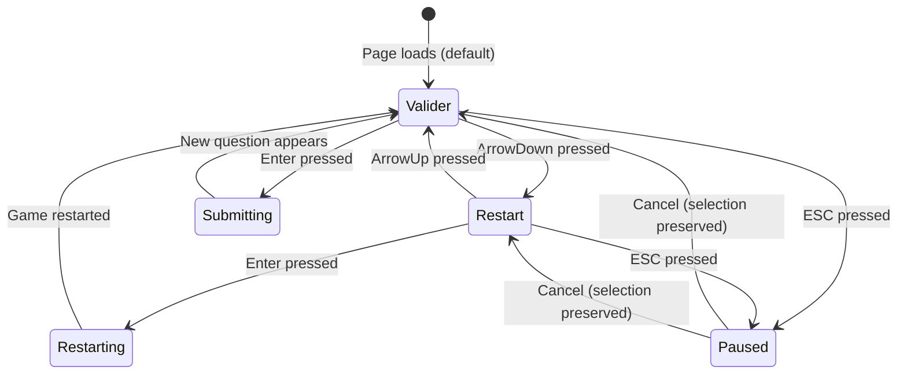

# Data Model: Unified Keyboard UI Navigation

**Feature**: 013-unified-keyboard-ui
**Date**: 2026-01-23
**Status**: Complete

## Overview

This feature is primarily UI-focused with minimal data persistence. The data model consists of transient UI state (selection indices, keyboard navigation state) and configuration objects (keyboard hints per screen). No new persistent data entities are required.

## UI State Entities

### NavigableOption

**Purpose**: Type definition for selectable options on PlayPage

**Type Definition** (`src/types/navigation.ts`):
```typescript
/**
 * Selectable options on the PlayPage during active gameplay
 * @public
 */
export type NavigableOption = 'valider' | 'restart'

/**
 * Configuration for navigable options component
 * @public
 */
export interface NavigableOptionsConfig {
  /** Available options to navigate between */
  options: readonly NavigableOption[]
  /** Default selected option when component mounts */
  defaultOption: NavigableOption
  /** Callback when "valider" option is confirmed */
  onValider: () => void
  /** Callback when "restart" option is confirmed */
  onRestart: () => void
}
```

**Lifecycle**:
- Created when PlayPage mounts
- Updated on ArrowUp/ArrowDown key press
- Reset to default when new question appears
- Preserved during pause menu open/close
- Destroyed when PlayPage unmounts

**Relationships**:
- Used by `useNavigableOptions` hook
- Consumed by PlayPage component

---

### SelectionState

**Purpose**: Generic state model for component selection tracking

**Type Definition** (`src/types/navigation.ts`):
```typescript
/**
 * Generic selection state for components with keyboard navigation
 * @public
 */
export interface SelectionState<T extends string> {
  /** Currently selected option */
  selectedOption: T
  /** Index of selected option in options array (for cycling) */
  selectedIndex: number
  /** Total number of available options */
  totalOptions: number
}
```

**Usage Examples**:
```typescript
// PlayPage navigation state
const selectionState: SelectionState<NavigableOption> = {
  selectedOption: 'valider',
  selectedIndex: 0,
  totalOptions: 2
}

// HomePage selection state (single option)
const homeSelectionState: SelectionState<'start'> = {
  selectedOption: 'start',
  selectedIndex: 0,
  totalOptions: 1
}
```

**State Transitions**:
```
INITIAL → "valider" selected (index 0)
ArrowDown → "restart" selected (index 1)
ArrowUp → "valider" selected (index 0)
Enter → Execute selected option → Reset to "valider"
New Question → Reset to "valider"
Pause Menu → (state preserved) → Resume → (state restored)
```

---

### KeyboardHint

**Purpose**: Configuration for displaying keyboard control hints

**Type Definition** (`src/components/KeyboardHints.tsx` - existing):
```typescript
/**
 * Individual keyboard hint displaying a key and its action
 * @public
 */
export interface KeyboardHint {
  /** Key representation (e.g., "↑↓", "Enter", "ESC") */
  key: string
  /** Human-readable description of key action */
  description: string
}

/**
 * Screen identifier for keyboard hints configuration
 * @public
 */
export type ScreenId =
  | 'player-select'
  | 'home'
  | 'play'
  | 'pause-menu'
  | 'results'
```

**Configuration Object** (`src/components/KeyboardHints.tsx`):
```typescript
/**
 * Keyboard hints configuration for all screens
 * Maps screen ID to array of available keyboard controls
 * @public
 */
export const KEYBOARD_HINTS_CONFIG: Record<ScreenId, KeyboardHint[]> = {
  'player-select': [
    { key: '↑↓', description: 'Navigate' },
    { key: 'Enter', description: 'Select' },
    { key: 'ESC', description: 'Exit' },
  ],
  home: [
    { key: '↑↓', description: 'Navigate' },
    { key: 'Enter', description: 'Select' },
    { key: 'ESC', description: 'Change Player' },
  ],
  play: [
    { key: '0-9', description: 'Type Answer' },
    { key: 'Backspace', description: 'Delete' },
    { key: '↑↓', description: 'Navigate Options' },
    { key: 'Enter', description: 'Confirm' },
    { key: 'ESC', description: 'Pause' },
  ],
  'pause-menu': [
    { key: '↑↓', description: 'Navigate' },
    { key: 'Enter', description: 'Confirm' },
    { key: 'ESC', description: 'Cancel' },
  ],
  results: [
    { key: 'Enter', description: 'Continue' },
    { key: 'ESC', description: 'Change Player' },
  ],
}
```

**Validation Rules**:
- `key` must be non-empty string
- `description` must be concise (≤20 characters recommended)
- Each screen should have 2-5 hints for readability
- Hints should be ordered by usage frequency (most common first)

---

## Hook Return Types

### UseNavigableOptionsReturn

**Purpose**: Return type for `useNavigableOptions` custom hook

**Type Definition** (`src/hooks/useNavigableOptions.ts`):
```typescript
/**
 * Return type for useNavigableOptions hook
 * Provides selection state and navigation functions for PlayPage options
 * @public
 */
export interface UseNavigableOptionsReturn {
  /** Currently selected option */
  selectedOption: NavigableOption
  /** Update selected option directly */
  setSelectedOption: (option: NavigableOption) => void
  /** Navigate to previous option (wraps around) */
  navigateUp: () => void
  /** Navigate to next option (wraps around) */
  navigateDown: () => void
  /** Execute action for currently selected option */
  executeSelectedOption: () => void
}
```

**State Management**:
- Internal state uses `useState<NavigableOption>`
- Selection cycles: valider ↔ restart (2 options)
- Default: 'valider' (from config)
- Reset: On new question, game restart

---

## Component Props

### JumpingArrow Props (Existing)

**Type Definition** (`src/components/JumpingArrow.tsx` - no changes):
```typescript
/**
 * Props for JumpingArrow component
 * @public
 */
export interface JumpingArrowProps {
  /** Whether the arrow should be visible */
  visible: boolean
}
```

**Usage**:
```typescript
<JumpingArrow visible={selectedOption === 'valider'} />
<button>Valider</button>
```

---

### KeyboardHints Props (Existing)

**Type Definition** (`src/components/KeyboardHints.tsx` - no changes):
```typescript
/**
 * Props for KeyboardHints component
 * @public
 */
export interface KeyboardHintsProps {
  /** Screen identifier to determine which hints to display */
  screenId: ScreenId
}
```

**Usage**:
```typescript
<KeyboardHints screenId="play" />
```

---

## Data Flow Diagram

```
┌─────────────────────────────────────────────────────────┐
│                      PlayPage Component                  │
│                                                           │
│  ┌────────────────────────────────────────────────────┐ │
│  │ useNavigableOptions Hook                           │ │
│  │                                                     │ │
│  │  State: selectedOption = 'valider' | 'restart'    │ │
│  │  State: selectedIndex = 0 | 1                     │ │
│  │                                                     │ │
│  │  Functions:                                        │ │
│  │    - navigateUp()    → cycles selection up        │ │
│  │    - navigateDown()  → cycles selection down      │ │
│  │    - executeSelectedOption() → calls callback     │ │
│  └────────────────────────────────────────────────────┘ │
│                           ↓                               │
│  ┌────────────────────────────────────────────────────┐ │
│  │ Keyboard Event Listener (useEffect)                │ │
│  │                                                     │ │
│  │  ArrowUp    → navigateUp()                        │ │
│  │  ArrowDown  → navigateDown()                      │ │
│  │  Enter      → executeSelectedOption()             │ │
│  │  0-9        → update answer input                 │ │
│  │  Backspace  → delete from answer input            │ │
│  └────────────────────────────────────────────────────┘ │
│                           ↓                               │
│  ┌────────────────────────────────────────────────────┐ │
│  │ UI Rendering                                       │ │
│  │                                                     │ │
│  │  <JumpingArrow visible={sel === 'valider'} />     │ │
│  │  <button>Valider</button>                         │ │
│  │                                                     │ │
│  │  <JumpingArrow visible={sel === 'restart'} />     │ │
│  │  <button>Restart</button>                         │ │
│  │                                                     │ │
│  │  <KeyboardHints screenId="play" />                │ │
│  └────────────────────────────────────────────────────┘ │
└─────────────────────────────────────────────────────────┘
```

---

## Persistence

**No persistent storage required** for this feature. All state is transient UI state:

| State | Storage | Lifetime | Reset Conditions |
|-------|---------|----------|------------------|
| selectedOption | React useState | Component lifecycle | New question, game restart |
| selectedIndex | React useState | Component lifecycle | New question, game restart |
| isButtonSelected | React useState | Component lifecycle | Page unmount |

**Existing localStorage usage** (unchanged):
- `players` - Array of Player objects
- `currentPlayer` - Currently selected player ID
- `scores` - Game scores array

---

## Validation & Constraints

### Type Safety
- All types use TypeScript strict mode
- No `any` types permitted
- Exported interfaces for all public APIs
- Union types for constrained string values (`NavigableOption`)

### Boundary Conditions
- ArrowUp at index 0 → wraps to last option
- ArrowDown at last index → wraps to index 0
- Single option screens → navigation does nothing (gracefully)

### State Invariants
- `selectedIndex` always in range [0, totalOptions - 1]
- `selectedOption` always matches `options[selectedIndex]`
- Default selection always 'valider' on PlayPage
- Selection state preserved during pause menu

---

## State Transitions (PlayPage)



---

## Testing Data

### Test Fixtures

```typescript
// Mock navigable options config
export const mockNavigableConfig: NavigableOptionsConfig = {
  options: ['valider', 'restart'] as const,
  defaultOption: 'valider',
  onValider: vi.fn(),
  onRestart: vi.fn(),
}

// Mock keyboard hints
export const mockPlayPageHints: KeyboardHint[] = [
  { key: '0-9', description: 'Type Answer' },
  { key: 'Backspace', description: 'Delete' },
  { key: '↑↓', description: 'Navigate Options' },
  { key: 'Enter', description: 'Confirm' },
  { key: 'ESC', description: 'Pause' },
]
```

### Test Scenarios

| Test Case | Initial State | Action | Expected State |
|-----------|---------------|--------|----------------|
| Default selection | - | Page loads | selectedOption: 'valider' |
| Navigate down | valider | ArrowDown | selectedOption: 'restart' |
| Navigate up | restart | ArrowUp | selectedOption: 'valider' |
| Execute valider | valider | Enter | onValider called |
| Execute restart | restart | Enter | onRestart called |
| Preserve on pause | restart | ESC → Cancel | selectedOption: 'restart' |
| Single option | - | ArrowDown | No change (graceful) |

---

## API Surface

### New Exports

**`src/types/navigation.ts`**:
- `NavigableOption` (type)
- `NavigableOptionsConfig` (interface)
- `SelectionState<T>` (interface)

**`src/hooks/useNavigableOptions.ts`**:
- `useNavigableOptions` (function)
- `UseNavigableOptionsReturn` (interface)

### Modified Exports

**`src/components/KeyboardHints.tsx`**:
- `KEYBOARD_HINTS_CONFIG` (object) - Updated configurations

### No Changes

**`src/components/JumpingArrow.tsx`** - No modifications required

---

## Summary

- **3 new type definitions**: NavigableOption, NavigableOptionsConfig, SelectionState
- **1 new hook**: useNavigableOptions with UseNavigableOptionsReturn interface
- **1 configuration update**: KEYBOARD_HINTS_CONFIG extended
- **0 persistent data entities**: All state is transient UI state
- **0 API contracts**: Pure frontend feature

All types follow strict TypeScript conventions with explicit return types and comprehensive JSDoc documentation.

---

**Data Model Status**: ✅ COMPLETE
**Next Phase**: quickstart.md - Implementation guide
